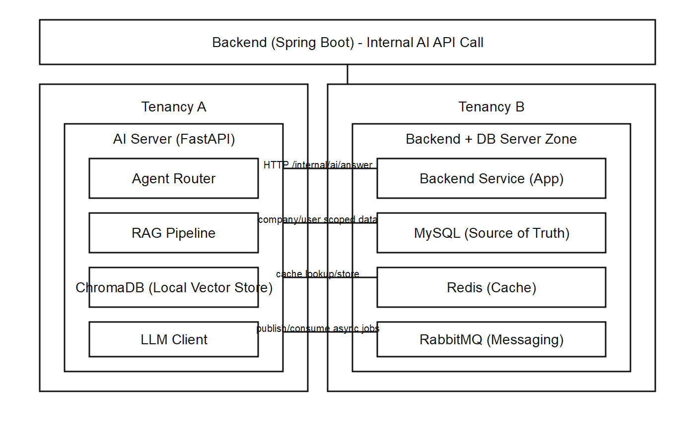

# WithBuddy AI 아키텍처

> LLM 기반 지능형 온보딩 비서 시스템

**최종 업데이트**: 2026-04-02  
**버전**: 1.2.1  
**작성일**: 2026-03-24

---

## 📋 목차

- [1. AI 시스템 개요](#1-ai-시스템-개요)
- [2. 기술 스택](#2-기술-스택)
- [3. RAG 파이프라인](#3-rag-파이프라인)
- [4. LangGraph Agent](#4-langgraph-agent)
- [5. Vector Database](#5-vector-database)
- [6. LLM 전략](#6-llm-전략)
- [7. Fine-tuning](#7-fine-tuning)
- [8. 캐싱 & 최적화](#8-캐싱--최적화)
- [변경 이력](#변경-이력)

---

## 1. AI 시스템 개요

### 1.1 AI 서비스 구조

[](./images/ai-service-structure-v2.png)

모바일에서는 이미지를 탭해 원본을 연 뒤 확대해서 확인하세요.

**MVP 전제**:
- AI 서버 1대에서 FastAPI + LangGraph + ChromaDB를 함께 운영한다.
- ChromaDB는 파일 기반으로 동작하며 별도 서버가 필요 없다.
- 최소 사양: CPU 2코어 / RAM 4GB, GPU 미사용.

### 1.2 프로젝트 식별자

| 구분 | 디렉토리 | 프로젝트명 | 엔트리포인트 | 기본 포트 |
|------|----------|------------|--------------|-----------|
| AI | `ai/` | withbuddy-ai | `app.main:app` | 8000 |

### 1.2 주요 기능

| 기능 | 설명 | 기술 |
|------|------|------|
| **Q&A** | 사내 문서 기반 질문 응답 | RAG + GPT-4 |
| **요약** | 기록/리포트 자동 요약 | GPT-4 Summarization |
| **추천** | 개인화된 체크리스트 추천 | Collaborative Filtering |
| **검색** | 문서 의미 기반 검색 | Vector Similarity Search |

### 1.3 런타임 데이터 경계 (중요)

AI 서버 런타임 경계는 다음 원칙을 따른다.

- AI 서버는 Backend 내부 API로 전달된 데이터만 사용한다.
- 사용자/회사/대화 원본 데이터의 최종 저장 책임은 Backend(MySQL)이다.
- AI 서버는 Redis 캐시와 RabbitMQ 큐를 보조 계층으로 사용한다.
- AI 서버가 MySQL에 직접 접근해야 하는 경우는 운영 점검/마이그레이션 등 제한된 시나리오로 한정한다.

---

## 2. 기술 스택

### 2.1 AI Framework

```yaml
# LLM 애플리케이션 프레임워크
LangChain: 0.1.0+
  - 문서 로더
  - 텍스트 분할
  - 임베딩 & 벡터 저장
  - Chain 구성

LangGraph: 0.0.20+
  - Agent 워크플로우
  - 상태 관리
  - 조건부 라우팅

# LLM 추론 엔진
vLLM: 0.3.0+
  - 고성능 추론
  - 배치 처리
  - GPU 최적화
```

### 2.2 AI Models

```yaml
# 상용 LLM
OpenAI GPT-4 Turbo
  - 용도: 복잡한 질문, 높은 품질
  - API: chat.completions

OpenAI GPT-3.5 Turbo
  - 용도: 간단한 질문, 비용 절감
  - API: chat.completions

# 오픈소스 LLM
Llama 3 (8B/70B)
  - 용도: 자체 호스팅, 비용 0원
  - 배포: vLLM

Qwen 2 (7B/72B)
  - 용도: 다국어 지원
  - 배포: vLLM

# Vision-Language Models
GPT-4 Vision
  - 용도: 이미지 기반 질문 (향후)
```

### 2.3 Vector Database

```yaml
# 벡터 저장소
ChromaDB: 0.4.0+
  - 용도: 중소규모 (<100만 문서)
  - 장점: 설치 쉬움, 관리 간편
  - 회사별 컬렉션 분리

FAISS: 1.7.0+
  - 용도: 대규모 (>100만 문서)
  - 장점: 초고속 검색
  - Meta 오픈소스

# 그래프 데이터베이스 (선택)
Neo4j: 5.0+
  - 용도: 지식 그래프, 관계 분석
  - 장점: 복잡한 관계 쿼리
```

### 2.4 ML/NLP Libraries

```yaml
# 딥러닝 프레임워크
PyTorch: 2.0+
  - 모델 학습/추론
  - CUDA 지원

# 모델 허브
HuggingFace Transformers: 4.30+
  - 사전학습 모델
  - Tokenizer
  - Pipeline

# 파인튜닝
PEFT (LoRA): 0.5.0+
  - Low-Rank Adaptation
  - 경량 파인튜닝

# 전통적 ML
Scikit-learn: 1.3+
  - 분류, 회귀
  - 클러스터링
```

---

## 3. RAG 파이프라인

### 3.1 문서 인덱싱 (Offline)

```python
from langchain.document_loaders import PDFLoader
from langchain.text_splitter import RecursiveCharacterTextSplitter
from langchain.embeddings import OpenAIEmbeddings
from langchain.vectorstores import Chroma

# 1. 문서 로드
documents = PDFLoader("company_hr_policy.pdf").load()

# 2. 텍스트 분할
splitter = RecursiveCharacterTextSplitter(
    chunk_size=1000,        # 청크 크기
    chunk_overlap=200,      # 중복 영역
    separators=["\n\n", "\n", " ", ""]
)
chunks = splitter.split_documents(documents)

# 3. 임베딩 생성 & 벡터 저장
embeddings = OpenAIEmbeddings(model="text-embedding-3-small")
vectorstore = Chroma.from_documents(
    documents=chunks,
    embedding=embeddings,
    collection_name=f"company_{company_id}_docs",
    persist_directory="./chroma_db"
)
```

#### 인덱싱 프로세스

```
PDF/Markdown 문서
  ↓
[Document Loader] 문서 로드
  ↓
[Text Splitter] 청크 분할 (1000자, 200자 오버랩)
  ↓
[Embedding Model] 벡터 변환 (1536차원)
  ↓
[Vector Store] ChromaDB 저장
  ↓
company_1001_docs 컬렉션
```

### 3.2 질문 응답 (Online)

```python
from langchain.chains import RetrievalQA
from langchain.llms import OpenAI

# 1. Retriever 설정
retriever = vectorstore.as_retriever(
    search_type="similarity",
    search_kwargs={"k": 3}  # 상위 3개 문서
)

# 2. QA Chain 구성
qa_chain = RetrievalQA.from_chain_type(
    llm=OpenAI(model="gpt-4-turbo-preview", temperature=0.7),
    chain_type="stuff",  # 모든 문서를 컨텍스트에 포함
    retriever=retriever,
    return_source_documents=True
)

# 3. 질문 처리
result = qa_chain({
    "query": "복지카드는 어떻게 신청하나요?"
})

# 응답
# result["result"]: "복지카드는 인사팀 포털에서..."
# result["source_documents"]: [Document(...), Document(...)]
```

#### 질문 응답 프로세스

```
사용자 질문: "복지카드 신청 방법은?"
  ↓
[Embedding] 질문 벡터화
  ↓
[Vector Search] 유사도 검색 (Top 3)
  ↓
관련 문서 3개 추출
  ↓
[LLM Prompt] 컨텍스트 + 질문 구성
  ↓
[GPT-4] 답변 생성
  ↓
답변 + 출처 문서 반환
```

### 3.3 프롬프트 엔지니어링

```python
# RAG 프롬프트 템플릿
PROMPT_TEMPLATE = """
당신은 신입사원 온보딩을 돕는 AI 비서입니다.

다음 문서를 참고하여 질문에 답변해주세요:
{context}

질문: {question}

답변 가이드라인:
1. 문서 내용을 기반으로 정확히 답변하세요
2. 문서에 없는 내용은 "해당 정보를 찾을 수 없습니다"라고 말하세요
3. 친절하고 이해하기 쉽게 설명하세요
4. 필요시 단계별로 설명하세요

답변:
"""
```

---

## 4. LangGraph Agent

### 4.1 Agent 워크플로우

```python
from langgraph.graph import StateGraph, END
from typing import TypedDict, List

# Agent 상태 정의
class AgentState(TypedDict):
    user_query: str
    company_id: int
    retrieved_docs: List[str]
    answer: str
    confidence: float
    needs_regeneration: bool

# 노드 함수들
def retrieve_documents(state: AgentState):
    """벡터 DB에서 관련 문서 검색"""
    docs = vectorstore.similarity_search(
        state["user_query"],
        filter={"company_id": state["company_id"]},
        k=3
    )
    return {"retrieved_docs": [doc.page_content for doc in docs]}

def generate_answer(state: AgentState):
    """LLM으로 답변 생성"""
    context = "\n\n".join(state["retrieved_docs"])
    prompt = f"Context: {context}\n\nQuestion: {state['user_query']}\n\nAnswer:"
    
    answer = llm.invoke(prompt)
    confidence = calculate_confidence(answer, state["retrieved_docs"])
    
    return {
        "answer": answer,
        "confidence": confidence
    }

def verify_answer(state: AgentState):
    """답변 검증"""
    if state["confidence"] < 0.7:
        return {"needs_regeneration": True}
    return {"needs_regeneration": False}

# 조건부 라우팅
def should_regenerate(state: AgentState):
    if state["needs_regeneration"]:
        return "regenerate"
    return "finish"

# 워크플로우 그래프 구성
workflow = StateGraph(AgentState)

# 노드 추가
workflow.add_node("retrieve", retrieve_documents)
workflow.add_node("generate", generate_answer)
workflow.add_node("verify", verify_answer)

# 엣지 정의
workflow.set_entry_point("retrieve")
workflow.add_edge("retrieve", "generate")
workflow.add_edge("generate", "verify")
workflow.add_conditional_edges(
    "verify",
    should_regenerate,
    {
        "regenerate": "generate",  # 재생성
        "finish": END              # 종료
    }
)

# 컴파일 & 실행
app = workflow.compile()
result = app.invoke({
    "user_query": "연차 신청 방법",
    "company_id": 1001
})
```

### 4.2 Agent 흐름도

```
START
  ↓
[retrieve] 문서 검색
  ↓
[generate] 답변 생성
  ↓
[verify] 신뢰도 검증
  ↓
신뢰도 < 0.7? ─Yes→ [generate] 재생성
  │
  No
  ↓
END (답변 반환)
```

---

## 5. Vector Database

### 5.1 ChromaDB 구조

```python
# 회사별 컬렉션 생성
collection = client.create_collection(
    name=f"company_{company_id}_documents",
    metadata={"company_id": company_id}
)

# 문서 추가
collection.add(
    documents=["1. 연차 신청은 인사 포털에서..."],
    metadatas=[{
        "company_id": 1001,
        "category": "HR",
        "document_id": "hr_policy_001",
        "title": "인사 규정"
    }],
    ids=["doc_hr_001"]
)

# 검색
results = collection.query(
    query_texts=["복지카드 신청"],
    n_results=3,
    where={"company_id": 1001}  # 회사별 필터링
)
```

#### 컬렉션 구조

```
ChromaDB
├── company_1001_documents
│   ├── doc_hr_001
│   │   ├── embedding: [0.123, -0.456, ..., 0.789]  # 1536차원
│   │   ├── metadata: {
│   │   │     "company_id": 1001,
│   │   │     "category": "HR",
│   │   │     "title": "인사 규정"
│   │   │   }
│   │   └── document: "1. 채용 절차..."
│   └── doc_it_001
│       └── ...
└── company_1002_documents
    └── ...
```

### 5.2 FAISS 인덱스 (대용량)

```python
import faiss
from langchain.vectorstores import FAISS

# FAISS 인덱스 생성
vectorstore = FAISS.from_documents(
    documents=chunks,
    embedding=embeddings
)

# 저장 (회사별)
vectorstore.save_local(f"./faiss_index/company_{company_id}")

# 로드
vectorstore = FAISS.load_local(
    f"./faiss_index/company_{company_id}",
    embeddings
)

# 검색 (매우 빠름)
docs = vectorstore.similarity_search("연차 신청", k=5)
```

---

## 6. LLM 전략

### 6.1 OpenAI API (기본)

```python
from langchain.llms import OpenAI

llm = OpenAI(
    model="gpt-4-turbo-preview",
    temperature=0.7,
    max_tokens=1000,
    top_p=0.9
)

response = llm.invoke("복지카드 신청 방법 설명")
```

**메모**: MVP에서는 단일 모델로 운영하고, 필요 시 모델 라우팅/오픈소스 도입은 후속 과제로 둔다.

---

## 7. Fine-tuning

MVP 범위에서는 파인튜닝을 진행하지 않는다. 필요 시 후속 단계에서 검토한다.

---

## 8. 캐싱 & 최적화

### 8.1 Redis 캐싱

```python
import redis
import hashlib
import json

redis_client = redis.Redis(
    host='localhost',
    port=6379,
    db=0,
    decode_responses=True
)

def get_cached_answer(query: str, company_id: int):
    # 캐시 키 생성
    cache_key = hashlib.md5(
        f"{company_id}:{query}".encode()
    ).hexdigest()
    
    # 캐시 조회
    cached = redis_client.get(cache_key)
    if cached:
        print("Cache HIT")
        return json.loads(cached)
    
    print("Cache MISS")
    
    # LLM 호출
    answer = qa_chain({"query": query})
    
    # 캐시 저장 (24시간)
    redis_client.setex(
        cache_key,
        86400,  # TTL: 24시간
        json.dumps(answer)
    )
    
    return answer
```

### 8.2 비용 추적

```python
class CostTracker:
    def __init__(self):
        self.costs = {
            "claude": 0.0  # 실제 단가는 과금 정책에 따라 설정
        }
    
    def calculate_cost(self, model: str, tokens: int):
        return self.costs.get(model, 0) * tokens
    
    def log_usage(self, company_id: int, model: str, tokens: int):
        cost = self.calculate_cost(model, tokens)
        
        # DB에 기록
        usage_log = {
            "company_id": company_id,
            "model": model,
            "tokens": tokens,
            "cost": cost,
            "timestamp": datetime.now()
        }
        
        db.save(usage_log)
        
        return cost
```

### 8.3 모니터링 (LangSmith)

```python
from langsmith import Client

client = Client()

# 체인 실행 추적
with client.trace(
    project_name="withbuddy-ai",
    tags=[f"company_{company_id}", "rag", "qa"]
):
    result = qa_chain({"query": query})

# 메트릭 수집
# - 응답 시간
# - 토큰 사용량
# - 에러율
# - 사용자 피드백
```

### 8.4 Redis + RabbitMQ 운영 패턴

#### 요청 처리 패턴

1. Backend → AI `/internal/ai/answer` 호출
2. AI 서버에서 Redis 캐시 조회 (`cache:{companyCode}:{hash(question)}`)
3. Cache hit면 즉시 응답 (채팅 UX 보호)
4. Cache miss면 RAG + LLM 실행 후 Redis TTL 저장
5. 시간이 오래 걸리는 작업(주간 회고/리포트/알림)은 RabbitMQ로 publish

#### 워크로드 분리 원칙 (Latency vs Throughput)

- Redis 담당:
  - 채팅 응답 캐시
  - 간단한 사용자 액션에 대한 경량 계산 결과 캐시
  - 세션 단위 임시 상태(유실 허용)
- RabbitMQ 담당:
  - 주간 회고 생성
  - 문서 재인덱싱/대량 후처리
  - 알림/리포트 비동기 파이프라인

운영 목표:
- 채팅/경량 액션: P95 응답시간 1.5초 이내를 목표로 캐시 우선 처리
- 회고/리포트: 즉시 응답 대신 작업 접수(`accepted`)를 반환하고 백그라운드 완료를 보장

#### 큐 토폴로지 예시

```text
Exchange: wb.ai.events (topic)
  - Queue: wb.report.generate
    Routing key: report.generate.requested
  - Queue: wb.docs.reindex
    Routing key: docs.reindex.requested
  - Queue: wb.notification.slack
    Routing key: notification.slack.requested
  - Queue: wb.deadletter (DLQ)
```

#### 재시도 정책 예시

- 최대 재시도: 3회
- 지수 백오프: 5s → 30s → 120s
- 3회 실패 시 DLQ로 이동
- DLQ 소비는 운영자 승인 또는 배치 재처리로 수행

#### API 응답 계약 권장

- 채팅/간단 액션 API: 동기 응답 + 필요 시 캐시 메타(`cache_hit`, `cache_ttl`) 제공
- 주간 회고 API: `202 Accepted` + `job_id` 반환 후 상태 조회/완료 알림으로 후속 처리
- 프론트엔드는 `processing`, `completed`, `failed` 상태를 명시적으로 구분해 사용자 불확실성을 줄인다

#### 저장소 책임 분리

- MySQL: 원본 대화/도메인 데이터(정합성 기준)
- Redis: 응답 성능 최적화 캐시(유실 허용)
- RabbitMQ: 비동기 작업 전달/재시도(처리 보장 계층)

---

## 부록

### A. 성능 벤치마크

MVP에서는 Claude API 기준으로 응답 시간/비용을 측정해 기록한다.

### B. 참고 자료

- [LangChain Documentation](https://python.langchain.com/)
- [LangGraph Guide](https://langchain-ai.github.io/langgraph/)
- [ChromaDB Guide](https://docs.trychroma.com/)
- [LoRA Paper](https://arxiv.org/abs/2106.09685)

---

## 변경 이력

- 2026-04-01: 1.1 AI 서비스 구조를 텍스트 블록에서 SVG 다이어그램 이미지로 전환하고 모바일 확대 안내를 추가.
- 2026-04-01: AI 런타임 데이터 경계 원칙(Backend 저장 책임, Redis/RabbitMQ 보조 계층)과 운영 패턴(큐 토폴로지, 재시도, 저장소 책임 분리)을 추가.
- 2026-04-01: AI 지연 대응을 위해 채팅/경량 액션은 Redis, 주간 회고/장시간 작업은 RabbitMQ로 분리하는 워크로드 정책과 API 응답 계약을 추가.
- 2026-04-02: 용어/링크/메타데이터 정합성 점검에 맞춰 문서 버전 표기를 최신 기준으로 정리.
- 2026-03-24: AI 아키텍처 문서 초안 정리.

