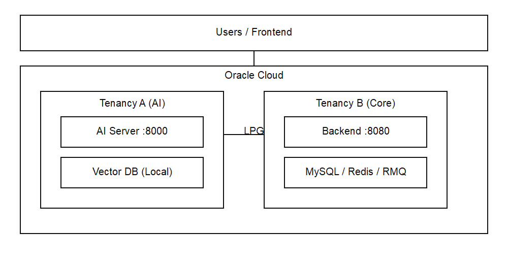

# WithBuddy 시스템 아키텍처

> 신입사원 온보딩 AI 통합 비서 서비스

**최종 업데이트**: 2026-05-11
**버전**: 0.63.1
**작성일**: 2026-03-27

---

## 목차

- [1. 시스템 개요](#1-시스템-개요)
- [2. 기술 스택](#2-기술-스택)
- [3. 시스템 구조도](#3-시스템-구조도)
- [4. 데이터 흐름](#4-데이터-흐름)
- [5. API 설계](#5-api-설계)
- [6. 관련 문서](#6-관련-문서)

---

## 1. 시스템 개요

### 1.1 전체 구조도

[](./images/architecture-overview-v2.png)

모바일에서는 이미지를 탭해 원본을 연 뒤 확대해서 확인하세요.

### 1.2 서버 구성

#### Frontend Server
- **호스팅**: Vercel
- **도메인**: Cloudflare 관리
- **프로토콜**: HTTPS
- **CDN**: Vercel Edge Network

#### Backend Server (VCN-B 내부)
- **위치**: Tenancy B VCN-B
- **포트**: 8080
- **프로토콜**: HTTP (내부), HTTPS (외부)
- **스케일링**: 수평 확장 가능

#### AI Server (VCN-A 내부)
- **위치**: Tenancy A VCN-A (다른 테넌시)
- **포트**: 8000
- **프로토콜**: HTTP (내부 전용)
- **통신**: Backend ↔ AI (LPG 기반 Private 통신)

#### Database Server (VCN-B 내부)
- **위치**: Tenancy B VCN-B
- **포트**: 3306(MySQL), 6379(Redis), 5672(RabbitMQ)
- **접근**: Private IP만 허용
- **백업**: 자동 백업 스케줄링
- **구성**: DB 서버 1대에 MySQL + Redis + RabbitMQ 공용 설치
- **역할 분리**:
  - Redis: 채팅/간단 액션 응답 캐시, 레이트리밋, 토큰 블랙리스트
  - RabbitMQ: 주간 회고/리포트/재인덱싱/알림 비동기 처리

### 1.3 프로젝트 식별자

| 구분 | 디렉토리 | 프로젝트명 | 식별자/패키지 | 기본 포트 |
|------|----------|------------|---------------|-----------|
| Backend | `backend/` | withbuddy | `com.withbuddy` | 8080 |
| Frontend | `frontend/` | withbuddy-frontend | `VITE_*` env 사용 | 5173 |
| AI | `ai/` | withbuddy-ai | `app.main:app` | 8000 |

---

## 2. 기술 스택

### 2.1 Frontend

```yaml
Framework: React 18
Build Tool: Vite
Language: JavaScript (ES6+)
State Management: Context API (JWT는 localStorage 저장, MVP)
Routing: React Router v6
HTTP Client: Axios
Styling: Tailwind CSS
UI Components: 
  - Headless UI (추천)
  - Radix UI (추천)
Form Handling: React Hook Form (추천)
Validation: Zod (추천)
Date Handling: date-fns / day.js
Charts: Recharts (추천)
Icons: Lucide React / Heroicons
```

### 2.2 Backend

```yaml
Framework: Spring Boot 3.5+
Language: Java 21
Build Tool: Gradle
Security: Spring Security + JWT
ORM: Spring Data JPA (Hibernate)
Database: MySQL 8.0
API Documentation: SpringDoc OpenAPI (Swagger)
Validation: Spring Validation
Logging: SLF4J + Logback
```

### 2.3 AI Service

```yaml
Framework: FastAPI
Language: Python 3.11+

# AI / LLM Framework
LLM Framework: 
  - LangChain (RAG)
  - LangGraph (오케스트레이터)
  - ChromaDB (임베딩 저장, 서버 내장)
Server:
  - Uvicorn

# AI Models
AI Provider: Anthropic Claude API (MVP)

# Database
Vector DB: 
  - ChromaDB (서버 내장, 파일 기반)
Graph DB: Neo4j (지식 그래프, 선택)
RDBMS: MySQL 8.0 (메타데이터)
NoSQL: Redis (캐싱)

MVP:
  - AI 서버 1대 + ChromaDB 내장 (별도 Chroma 서버 없음)

# Data & Prototyping
Data Processing: pandas, numpy
Visualization: Plotly, Streamlit
Prototyping: Jupyter Notebook

# Machine Learning / NLP
ML Framework: 
  - Scikit-learn (전통적 ML)
  - PyTorch (딥러닝)
Model Hub: HuggingFace Transformers
Fine-tuning: LoRA (Low-Rank Adaptation)

# HTTP & Async
HTTP Client: httpx
Async: asyncio
Cache: Redis
```

### 2.4 Infrastructure

```yaml
Cloud Provider: Oracle Cloud
Network: VCN x2 (Tenancy 분리) + Local VCN Peering (LPG)
Storage: OCI Block Volume + OCI Object Storage
Cache: Redis
Messaging System: RabbitMQ
Domain: Cloudflare
Frontend Hosting: Vercel
SSL/TLS: Let's Encrypt / Cloudflare SSL
```

### 2.5 DevOps & Tools

```yaml
Version Control: Git + GitHub
CI/CD: GitHub Actions
Monitoring: 
  - Application: Spring Boot Actuator
  - Error Tracking: Sentry (추천)
  - Logging: OCI Logging / ELK Stack (추천)
API Testing: Postman / REST Client
Load Testing: JMeter / k6
```

### 2.6 Cache와 Messaging 역할 분리

```yaml
Cache Layer:
  Component: Redis
  Role:
    - AI 응답 캐시 (짧은 TTL)
    - 토큰 블랙리스트
    - Rate limiting 카운터
  Rule:
    - 유실 가능 데이터만 저장
    - 원본 데이터 저장소로 사용하지 않음

Messaging Layer:
  Component: RabbitMQ
  Role:
    - 비동기 작업 큐
    - 재시도/실패 큐(DLQ) 처리
  Use Cases:
    - 주간 리포트 생성
    - 문서 임베딩/재인덱싱
    - Slack 알림 발송
```

운영 원칙:
- 사용자 대화 원본은 MySQL(`chat_messages`)에 저장한다.
- Redis는 응답 성능 최적화를 담당하고, RabbitMQ는 메시징 시스템으로서 작업 전달/처리 보장을 담당한다.
- 즉시 응답이 필요한 API 경로와 비동기 백그라운드 경로를 분리한다.

### 2.7 지연 대응 워크로드 분류 정책

서비스 이탈을 줄이기 위해, AI 지연 가능성이 있는 요청은 아래 기준으로 분리 처리한다.

- Redis 경로(즉시성 우선): 채팅 응답, 짧은 액션, UI 상호작용에 필요한 경량 연산
- RabbitMQ 경로(완결성 우선): 주간 회고 생성, 대용량 요약, 재인덱싱, 알림 배치

분류 기준:
- 사용자 체감 지연이 큰 경로는 동기 처리 대신 Redis 캐시를 먼저 조회해 즉시 응답을 보장한다.
- 실행 시간이 길거나 재시도/순서 보장이 필요한 경로는 RabbitMQ에 위임한다.
- API는 `sync-response`와 `async-accepted`를 분리해, 프론트엔드가 상태를 명확히 표시하도록 한다.

---

## 3. 시스템 구조도

### 3.1 멀티 테넌시 구조

WithBuddy는 **여러 회사가 동시에 사용하는 SaaS 서비스**입니다.

```
회사 A (companyCode: WB1001)
├── 김지원 (사원번호: 20260001)
│   ├── 체크리스트 10개
│   └── 기록 25개
└── 박민수 (사원번호: 20260002)

회사 B (companyCode: WB1002)
├── 이영희 (사원번호: 20260001)  ← 같은 사번!
│   ├── 체크리스트 8개
│   └── 기록 30개
└── 최철수 (사원번호: 20260002)
```

**핵심**:
- 각 회사는 고유한 `companyCode`로 식별
- 회사별 데이터 완전 격리
- 같은 사원번호를 다른 회사에서 사용 가능

**상세 문서**: [MULTI_TENANCY.md](../MULTI_TENANCY.md)

---

## 4. 데이터 흐름

### 4.1 로그인 흐름

```
[사용자] 회사코드 + 사원번호 + 이름 입력
   ↓
[Frontend] POST /api/v1/auth/login
   ↓
[Backend] 
   - Company 테이블에서 companyCode 조회
   - User 테이블에서 (company_code, employee_number) 조회
   - 이름 검증
   ↓
[Backend] JWT 생성 (companyCode 포함)
   ↓
[Frontend] JWT 저장
```

### 4.2 AI 질문 응답 흐름

```
[사용자] "복지카드는 어떻게 신청하나요?"
   ↓
[Frontend] POST /api/v1/ai/chat
   ↓
[Backend] JWT 검증 → companyCode 추출
   ↓
[AI Server] 
   - 해당 회사의 Vector DB에서 문서 검색
   - LLM에 컨텍스트 + 질문 전달
   - Claude API 답변 생성
   ↓
[Backend] 응답 저장 & 캐싱
   ↓
[Frontend] 답변 + 출처 문서 표시
```

### 4.3 비동기 작업 흐름 (RabbitMQ)

```
[Backend] 이벤트 생성 (예: report.generate.requested)
   ↓ publish
[RabbitMQ Exchange]
   ↓ route
[Queue: report-generation]
   ↓ consume
[Worker] 작업 처리 (AI/Backend worker)
   ↓
[MySQL] 결과 저장
   ↓
[Redis] 최신 상태/요약 캐시 갱신 (선택)
```

---

## 5. API 설계

### 5.1 API 버전 관리

모든 공개 API는 `/api/v1/` prefix를 사용한다.

API 설계는 아래 두 범위를 함께 관리한다.
- **현재 운영 API (MVP)**: 실제 배포/구현 기준
- **목표 API (Planned)**: 단계적 확장 목표

```
/api/v1/auth/*       # 인증
/api/v1/ai/*         # AI 도우미(백엔드 공개 경로 기준)
/api/v1/users/*      # 사용자 관리 (Planned)
/api/v1/companies/*  # 회사 정보 (Planned)
/api/v1/checklists/* # 체크리스트 (Planned)
/api/v1/records/*    # 기록 (Planned)
/api/v1/reports/*    # 리포트 (Planned)
/api/v1/documents/*  # 문서 관리 (Planned)
/api/v1/progress/*   # 진행률 (Planned)
```

### 5.2 주요 엔드포인트

#### 현재 운영 API (MVP)

**인증 (Backend)**
```http
POST /api/v1/auth/login      # 로그인
```

**AI 연동 (현재 구현 기준)**
```http
POST /internal/ai/answer      # Backend → AI 서버 내부 연동
```

#### 목표 API (Planned)

**인증**
```http
POST /api/v1/auth/signup      # 회원가입
POST /api/v1/auth/refresh     # 토큰 재발급
POST /api/v1/auth/logout      # 로그아웃
```

**AI Agent**
```http
POST /api/v1/ai/chat                      # 질문하기
GET  /api/v1/ai/conversations             # 대화 히스토리
GET  /api/v1/ai/conversations/{id}        # 특정 대화 조회
DELETE /api/v1/ai/conversations/{id}      # 대화 삭제
```

**체크리스트**
```http
GET  /api/v1/checklists                   # 전체 조회
GET  /api/v1/checklists?week=1            # 주차별 조회
POST /api/v1/checklists/{id}/complete     # 완료 처리
POST /api/v1/checklists/{id}/incomplete   # 미완료 처리
```

**기록**
```http
POST   /api/v1/records                    # 기록 작성
GET    /api/v1/records                    # 목록 조회
GET    /api/v1/records/{id}               # 상세 조회
PUT    /api/v1/records/{id}               # 수정
DELETE /api/v1/records/{id}               # 삭제
POST   /api/v1/records/{id}/summary       # AI 요약 생성
```

**상세 문서**
- 현재 운영 API: [API.md](../API.md)
- 목표 API: [PLANNED_API.md](../api/PLANNED_API.md)

---

## 6. 관련 문서

### 상세 기술 문서

| 문서 | 설명 |
|------|------|
| [MULTI_TENANCY.md](../MULTI_TENANCY.md) | 멀티 테넌시 아키텍처 상세 |
| [AI_ARCHITECTURE.md](./AI_ARCHITECTURE.md) | AI 시스템 아키텍처 |
| [INFRASTRUCTURE.md](./INFRASTRUCTURE.md) | 인프라 구성 및 네트워크 |
| [SECURITY.md](../SECURITY.md) | 보안 설계 및 인증/인가 |
| [DEPLOYMENT.md](./DEPLOYMENT.md) | 배포 전략 및 CI/CD |

### API 및 환경 설정

| 문서 | 설명 |
|------|------|
| [API.md](../API.md) | 전체 API 명세서 |
| [ENV.md](../guides/ENV.md) | 환경변수 가이드 |

### 개발 가이드

| 문서 | 설명 |
|------|------|
| [SETUP.md](../guides/SETUP.md) | 로컬 개발 환경 설정 |
| [CONTRIBUTING.md](../guides/CONTRIBUTING.md) | 기여 가이드 |

---

## 부록

### A. 기술 스택 버전 정보

| 카테고리 | 기술 | 버전 |
|---------|------|------|
| Backend | Java | 21 |
| | Spring Boot | 3.5+ |
| | MySQL | 8.0 |
| Frontend | React | 18+ |
| | Vite | 최신 |
| AI | Python | 3.11+ |
| | FastAPI | 최신 |
| Infrastructure | Redis | 7+ |

### B. 용어 정리

- **VCN**: Virtual Cloud Network, 클라우드 내 가상 네트워크
- **JWT**: JSON Web Token, 토큰 기반 인증
- **CORS**: Cross-Origin Resource Sharing, 교차 출처 리소스 공유
- **Rate Limiting**: API 호출 빈도 제한
- **CDN**: Content Delivery Network, 콘텐츠 전송 네트워크
- **RAG**: Retrieval-Augmented Generation, 검색 증강 생성
- **LoRA**: Low-Rank Adaptation, 경량 모델 파인튜닝

---

## 변경 이력

- 2026-04-09: 인프라 기술 스택 표기를 OCI 기준으로 정리하고, 스토리지와 로깅 항목의 클라우드 혼합 표현을 제거.
- 2026-04-06: API 설계를 현재 운영(MVP)과 목표(Planned)로 분리하고, 운영 API는 `API.md`, 목표 API는 `PLANNED_API.md`를 참조하도록 정리.
- 2026-04-02: 문서 링크 경로와 서버 구성 표기를 현재 파일 구조 기준으로 정리.- 
- 2026-04-01: Redis(캐시)와 RabbitMQ(메시징) 역할 분리 원칙 및 비동기 작업 흐름을 추가.
- 2026-03-27: 오사카 리전 기준 테넌시 분리 구조 반영, LPG 통신 경로 및 다이어그램 업데이트, Infrastructure 항목 최신화, 구조도 이미지 추가.
- 


