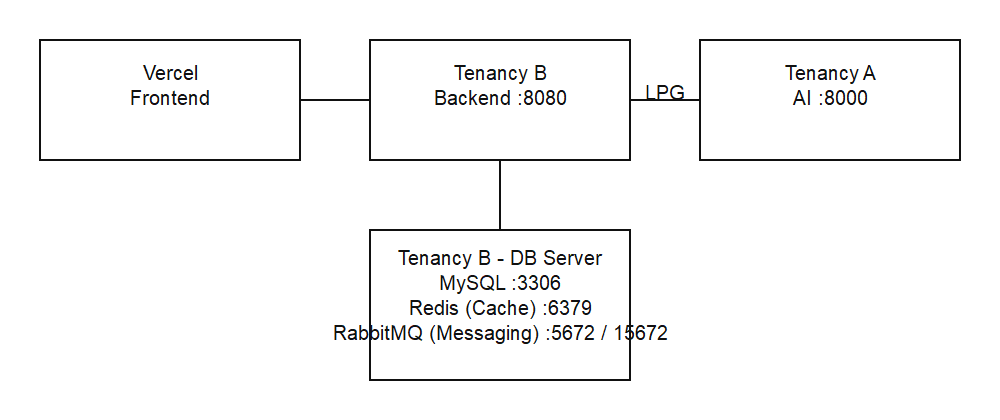

# Oracle Cloud 배포 가이드

> WithBuddy Oracle Cloud 배포 완벽 가이드

**최종 업데이트**: 2026-04-06  
**버전**: 1.3.3  
**작성일**: 2026-03-27

## 목차
- [인프라 개요](#인프라-개요)
- [Oracle Cloud 리소스 생성](#oracle-cloud-리소스-생성)
- [VCN 및 네트워크 설정](#vcn-및-네트워크-설정)
- [Backend 배포](#backend-배포-oracle-compute)
- [AI 서버 배포](#ai-서버-배포-oracle-compute)
- [MySQL 배포](#mysql-배포-oracle-compute)
- [Frontend 배포](#frontend-배포-vercel)
- [GitHub Actions 설정](#github-actions-설정)

---

## 프로젝트 표준

| 구분 | 디렉토리 | 프로젝트명 | 식별자/패키지 | 기본 포트 |
|------|----------|------------|---------------|-----------|
| Backend | `backend/` | withbuddy | `com.withbuddy` | 8080 |
| Frontend | `frontend/` | withbuddy-frontend | `VITE_*` env 사용 | 5173 |
| AI | `ai/` | withbuddy-ai | `app.main:app` | 8000 |

---

## 인프라 개요

[](./images/deployment-overview.png)

모바일에서는 이미지를 탭해 원본을 연 뒤 확대해서 확인하세요.

### 리소스 구성
```yaml
Frontend:
  - Platform: Vercel
  - Domain: withbuddy-rust.vercel.app (기본), withbuddy.itsdev.kr (Cloudflare DNS 연결 커스텀 도메인)
  - CDN: Vercel Edge Network
  - HTTPS: 자동 제공

Backend Server (Tenancy B):
  - Provider: Oracle Cloud Compute
  - OS: Canonical Ubuntu 24.04
  - Shape: VM.Standard.A1.Flex (2 OCPU / 12GB RAM)
  - IP: 공인 IP 할당
  - Port: 8080 (Spring Boot)

AI Server (Tenancy A):
  - Provider: Oracle Cloud Compute
  - OS: Canonical Ubuntu 24.04
  - Shape: VM.Standard.A1.Flex (4 OCPU / 24GB RAM)
  - IP: Private IP 권장
  - Port: 8000 (FastAPI)

MySQL/Redis/RMQ Server (Tenancy B):
  - Provider: Oracle Cloud Compute
  - OS: Canonical Ubuntu 24.04
  - Shape: VM.Standard.A1.Flex (2 OCPU / 12GB RAM)
  - IP: Private IP만 사용 (VCN 내부)
  - Port: 3306

```

---

## Oracle Cloud 리소스 생성

### 1. 컴퓨트 인스턴스 생성 (3개, 테넌시 분리)

**Backend 인스턴스 (Tenancy B)**
```
Name: withbuddy-backend
Image: Canonical Ubuntu 24.04
Shape: VM.Standard.A1.Flex (2 OCPU / 12GB)
Network: 공인 IP 할당
Boot Volume: 50GB
```

**AI 서버 인스턴스 (Tenancy A)**
```
Name: withbuddy-ai
Image: Canonical Ubuntu 24.04
Shape: VM.Standard.A1.Flex (4 OCPU / 24GB)
Network: Private IP 권장 (Public IP는 운영자만 제한)
Boot Volume: 50GB
```

**MySQL(Redis/RMQ) 인스턴스 (Tenancy B)**
```
Name: withbuddy-mysql
Image: Canonical Ubuntu 24.04
Shape: VM.Standard.A1.Flex (2 OCPU / 12GB)
Network: Private IP만 (공인 IP 미할당)
Boot Volume: 50GB
```

### 2. SSH 키 생성 및 등록
```bash
# 로컬에서 SSH 키 생성 (권장: Ed25519)
ssh-keygen -t ed25519 -f ~/.ssh/withbuddy_oracle

# 구형 환경 호환이 필요하면 RSA 사용 가능
# ssh-keygen -t rsa -b 4096 -f ~/.ssh/withbuddy_oracle

# 공개키 내용 복사
cat ~/.ssh/withbuddy_oracle.pub

# Oracle Cloud 인스턴스 생성 시 공개키 붙여넣기
```

---

## VCN 및 네트워크 설정

### 1. VCN (Virtual Cloud Network) 생성
**Tenancy A (AI)**
```
Name: withbuddy-vcn-ai
CIDR Block: 10.1.0.0/16
```

**Tenancy B (Backend/DB/Core Services)**
``` 
Name: withbuddy-vcn-core
CIDR Block: 10.0.0.0/16
```

**중요**: 두 VCN CIDR은 반드시 겹치지 않아야 한다.

### 2. 서브넷 생성
```
VCN-B Public Subnet:
  Name: withbuddy-public-subnet
  CIDR: 10.0.1.0/24
  Purpose: Backend

VCN-B Private DB Subnet:
  Name: withbuddy-private-subnet
  CIDR: 10.0.3.0/24
  Purpose: MySQL/Redis/RMQ

VCN-A Private AI Subnet:
  Name: withbuddy-ai-subnet
  CIDR: 10.1.2.0/24
  Purpose: AI Server
```

### 3. Local VCN Peering (LPG) 설정

1. 각 테넌시에서 LPG 생성  
2. 서로 LPG OCID 교환  
3. Requestor가 `peer-id`로 연결  
4. 라우트 테이블에 상대 VCN CIDR → LPG 추가

### 4. 보안 목록 (Security List) 설정

**VCN-B Public Subnet 보안 규칙 (Backend)**
```
Ingress Rules:
  - 22 (SSH) from 0.0.0.0/0
  - 8080 (Backend) from 0.0.0.0/0
  - 443 (HTTPS) from 0.0.0.0/0

Egress Rules:
  - All traffic to 0.0.0.0/0
```

**VCN-A Private AI Subnet 보안 규칙**
```
Ingress Rules:
  - 8000 (AI) from 10.0.0.0/16 (VCN-B only)
Egress Rules:
  - All traffic to 0.0.0.0/0 (필요 시 제한)
```

**VCN-B Private DB Subnet 보안 규칙**
```
Ingress Rules:
  - 3306 (MySQL) from 10.0.0.0/16 (VCN-B)

Egress Rules:
  - All traffic to 0.0.0.0/0
```

### 5. 인터넷 게이트웨이 설정 (VCN-B)
```
Name: withbuddy-internet-gateway
Attached to: withbuddy-vcn-core
```

### 6. 라우팅 테이블
```
VCN-B Public Subnet Route Table:
  Destination: 0.0.0.0/0
  Target: Internet Gateway

VCN-B Route Table (LPG):
  Destination: 10.1.0.0/16
  Target: LPG-B

VCN-A Route Table (LPG):
  Destination: 10.0.0.0/16
  Target: LPG-A
```

---

## Backend 배포 (Oracle Compute)

### 1. 서버 접속
```bash
ssh -i ~/.ssh/withbuddy_oracle ubuntu@<BACKEND_PUBLIC_IP>
```

### 2. 시스템 업데이트
```bash
sudo apt update
sudo apt upgrade -y
```

### 3. Java 21 설치
```bash
sudo apt install openjdk-21-jdk -y
java -version
```

### 4. 디렉토리 생성
```bash
mkdir -p /home/ubuntu/withbuddy
```

### 5. 백엔드 서비스 실행 방식

- 현재 `.github/workflows/backend-deploy.yml` 기준 기본 배포는 `java -jar` 재기동 방식이며, `/etc/systemd/system/withbuddy.service` 파일은 필수 아님.
- systemd 운영을 적용할 경우 서비스명은 `withbuddy-backend.service`로 통일한다.

**(선택) /etc/systemd/system/withbuddy-backend.service**
```ini
[Unit]
Description=WithBuddy Backend Service
After=network.target

[Service]
Type=simple
User=ubuntu
WorkingDirectory=/home/ubuntu/withbuddy
EnvironmentFile=/home/ubuntu/withbuddy/backend.env
ExecStart=/usr/bin/java -jar /home/ubuntu/withbuddy/app.jar --spring.profiles.active=prod
Restart=on-failure
RestartSec=10
StandardOutput=journal
StandardError=journal

[Install]
WantedBy=multi-user.target
```

### 6. 방화벽 설정 (UFW)
```bash
sudo apt install ufw
sudo ufw allow 22
sudo ufw allow 8080
sudo ufw enable
sudo ufw status
```

---

## AI 서버 배포 (Oracle Compute)

### 1. 서버 접속
```bash
ssh -i ~/.ssh/withbuddy_oracle ubuntu@<AI_PUBLIC_IP>
```

### 2. Python 3.11 설치
```bash
sudo apt update
sudo apt install python3.11 python3.11-venv python3-pip -y
```

### 3. 프로젝트 디렉토리 생성
```bash
mkdir -p /home/ubuntu/withbuddy/ai
```

### 4. systemd 서비스 생성

**/etc/systemd/system/withbuddy-ai.service**
```ini
[Unit]
Description=WithBuddy AI FastAPI Application
After=network.target

[Service]
Type=simple
User=ubuntu
WorkingDirectory=/home/ubuntu/withbuddy/ai
ExecStart=/home/ubuntu/withbuddy/ai/venv/bin/uvicorn app.main:app --host 0.0.0.0 --port 8000
Restart=on-failure
RestartSec=10

Environment="ANTHROPIC_API_KEY=your_api_key"
Environment="CHROMA_PERSIST_DIR=/home/ubuntu/withbuddy/ai/chroma_db"

[Install]
WantedBy=multi-user.target
```

### 5. 방화벽 설정
```bash
sudo ufw allow 22
sudo ufw allow from 10.0.0.0/16 to any port 8000
sudo ufw enable
```

---

## MySQL 배포 (Oracle Compute)

### 1. 서버 접속
```bash
# Public Subnet의 Backend 서버를 통해 접속
ssh -i ~/.ssh/withbuddy_oracle ubuntu@<BACKEND_PUBLIC_IP>
ssh ubuntu@<MYSQL_PRIVATE_IP>
```

### 2. MySQL 설치
```bash
sudo apt update
sudo apt install mysql-server -y
```

### 3. MySQL 보안 설정
```bash
sudo mysql_secure_installation
```

### 4. 데이터베이스 및 사용자 생성
```bash
sudo mysql

CREATE DATABASE withbuddy CHARACTER SET utf8mb4 COLLATE utf8mb4_unicode_ci;
CREATE USER 'withbuddy'@'%' IDENTIFIED BY 'your_password';
GRANT ALL PRIVILEGES ON withbuddy.* TO 'withbuddy'@'%';
FLUSH PRIVILEGES;
EXIT;
```

### 5. 외부 접속 허용 설정

**/etc/mysql/mysql.conf.d/mysqld.cnf**
```ini
[mysqld]
bind-address = 0.0.0.0
```

```bash
sudo systemctl restart mysql
```

### 6. 자동 백업 스크립트

**/home/ubuntu/backup-mysql.sh**
```bash
#!/bin/bash
DATE=$(date +%Y%m%d_%H%M%S)
BACKUP_DIR="/home/ubuntu/mysql-backups"
mkdir -p $BACKUP_DIR

mysqldump -u withbuddy -p'your_password' withbuddy | gzip > $BACKUP_DIR/withbuddy_$DATE.sql.gz

# 7일 이상 된 백업 삭제
find $BACKUP_DIR -name "*.sql.gz" -mtime +7 -delete
```

```bash
chmod +x /home/ubuntu/backup-mysql.sh

# cron 등록 (매일 새벽 3시)
crontab -e
0 3 * * * /home/ubuntu/backup-mysql.sh
```

---

## Frontend 배포 (Vercel)

### 1. Vercel 계정 생성
https://vercel.com

### 2. GitHub 연동
```
1. Vercel > Add New Project
2. Import Git Repository
3. WithBuddyAi/withbuddy 선택
4. 설정:

Framework preset: Vite
Build command: npm run build
Output directory: dist
Root directory: frontend
```

### 3. 환경변수 설정
```
Settings > Environment Variables

Production:
  VITE_API_BASE_URL=http://<BACKEND_PUBLIC_IP>:8080/api

Preview:
  VITE_API_BASE_URL=http://<BACKEND_PUBLIC_IP>:8080/api
```

### 4. 커스텀 도메인 (선택)
```
Settings > Custom domains
도메인 추가 및 DNS 설정
```

---

## GitHub Actions 설정

### 1. GitHub Secrets 설정

**Repository > Settings > Secrets and variables > Actions**
```
SSH_PRIVATE_KEY=<withbuddy_oracle 개인키 전체 내용>
BACKEND_SERVER_IP=<Backend 공인 IP>
AI_SERVER_IP=<AI 서버 공인 IP>
SERVER_USER=ubuntu
SPRING_DB_PASSWORD=<MySQL 비밀번호>
JWT_SECRET=<JWT Secret>
AI_API_URL=https://ai.itsdev.kr
ANTHROPIC_API_KEY=<Anthropic API Key>
```

### 1-1. 현재 AI 배포 워크플로우 기준 필수 Secrets (2026-03-29)

현재 저장소의 [`ai-deploy.yml`](../../.github/workflows/ai-deploy.yml)은 아래 시크릿을 사용한다.

```bash
${{ secrets.AI_SERVER_HOST }}=<예: AI_SERVER_PUBLIC_IP>
${{ secrets.AI_SERVER_USER }}=ubuntu
${{ secrets.AI_SERVER_SSH_KEY }}=<AI 서버 접속 개인키 전체>
${{ secrets.AI_APP_DIR }}=/home/ubuntu/withbuddy/ai
${{ secrets.AI_SERVICE_NAME }}=withbuddy-ai
```

등록 상태:
- 위 5개 시크릿은 GitHub Actions `Environment: production`에 등록 완료됨 (확인일: 2026-03-30).

주의:
- 위 5개 시크릿 중 하나라도 누락되면 배포가 실패한다.
- 기존 `AI_SERVER_IP`, `SERVER_USER`, `SSH_PRIVATE_KEY` 기반 예시와 혼용하지 않는다.

### 1-2. AI 자동배포 선행 조건 (서버 측)

`ai-deploy.yml`은 원격 서버에서 `git pull`, `venv activate`, `pip install`, `systemctl restart`를 수행한다.
따라서 서버는 아래 조건을 만족해야 한다.

1. `${{ secrets.AI_APP_DIR }}` 경로가 git repository여야 한다.
2. `${{ secrets.AI_APP_DIR }}/venv`가 존재해야 한다.
3. `${{ secrets.AI_SERVICE_NAME }}` 서비스 파일이 systemd에 등록되어 있어야 한다.
4. 배포 계정이 아래 명령을 sudo 비밀번호 없이 실행 가능해야 한다.
   - `systemctl restart <${{ secrets.AI_SERVICE_NAME }}>`
   - `systemctl status <${{ secrets.AI_SERVICE_NAME }}>`
5. 서비스 재시작 후 `127.0.0.1:8000/health`가 정상 응답해야 한다.

### 1-3. AI 서버 사전 점검 명령어

```bash
ssh -i ~/.ssh/ssh-withbuddy.key ubuntu@<AI_SERVER_PUBLIC_IP>

cd /home/ubuntu/withbuddy/ai
test -d .git && echo "git repo ok"
test -d venv && echo "venv ok"
sudo systemctl status --no-pager withbuddy-ai
curl -i http://127.0.0.1:8000/health
```

### 2. Backend 배포 워크플로우

**.github/workflows/backend-deploy.yml**
```yaml
name: Deploy Backend to Oracle Cloud

on:
  push:
    branches: [ main ]
    paths:
      - 'backend/**'
  workflow_dispatch:

concurrency:
  group: ${{ github.workflow }}-${{ github.ref }}
  cancel-in-progress: true

jobs:
  build-and-deploy:
    runs-on: ubuntu-latest
    
    steps:
      - name: Checkout code
        uses: actions/checkout@v3
      
      - name: Set up JDK 21
        uses: actions/setup-java@v3
        with:
          java-version: '21'
          distribution: 'temurin'
      
      - name: Make gradlew executable
        working-directory: ./backend
        run: chmod +x gradlew
      
      - name: Build with Gradle
        working-directory: ./backend
        run: ./gradlew clean build -x test --no-daemon
      
      - name: List JAR files
        working-directory: ./backend
        run: ls -lh build/libs/
      
      - name: Deploy to Oracle Cloud
        env:
          SSH_PRIVATE_KEY: ${{ secrets.SSH_PRIVATE_KEY }}
          SERVER_IP: ${{ secrets.BACKEND_SERVER_IP }}
          SERVER_USER: ${{ secrets.SERVER_USER }}
SPRING_DB_PASSWORD: ${{ secrets.SPRING_DB_PASSWORD }}
          JWT_SECRET: ${{ secrets.JWT_SECRET }}
          AI_API_URL: ${{ secrets.AI_API_URL }}
        run: |
          mkdir -p ~/.ssh
          chmod 700 ~/.ssh
          echo "$SSH_PRIVATE_KEY" > ~/.ssh/id_rsa
          chmod 600 ~/.ssh/id_rsa
          ssh-keyscan -H "$SERVER_IP" >> ~/.ssh/known_hosts 2>/dev/null
          
          echo "=== Deploying JAR ==="
          scp -i ~/.ssh/id_rsa -o StrictHostKeyChecking=no \
            backend/build/libs/withbuddy-0.0.1-SNAPSHOT.jar \
            $SERVER_USER@$SERVER_IP:/home/ubuntu/withbuddy/app.jar
          
          echo "=== Starting Application ==="
          ssh -i ~/.ssh/id_rsa -o StrictHostKeyChecking=no $SERVER_USER@$SERVER_IP \
"SPRING_DB_PASSWORD='$SPRING_DB_PASSWORD' JWT_SECRET='$JWT_SECRET' AI_API_URL='$AI_API_URL' bash -s" << 'ENDSSH'
          
          # 기존 프로세스 종료
          pkill -9 -f "java -jar" || true
          sleep 3
          
          # 재확인
          if pgrep -f "java -jar"; then
            echo "Still running, force killing..."
            pkill -9 -f "java -jar"
            sleep 2
          fi          
          
          # 환경변수 확인
echo "SPRING_DB_PASSWORD length: ${#SPRING_DB_PASSWORD}"
          echo "JWT_SECRET length: ${#JWT_SECRET}"
          
          # 애플리케이션 시작
          nohup java -jar /home/ubuntu/withbuddy/app.jar \
            --spring.profiles.active=prod \
            --spring.datasource.url="jdbc:mysql://10.0.3.10:3306/withbuddy?serverTimezone=Asia/Seoul&useSSL=false&allowPublicKeyRetrieval=true" \
            --spring.datasource.username=withbuddy \
--spring.datasource.password="${SPRING_DB_PASSWORD}" \
            --jwt.secret="${JWT_SECRET}" \
            --ai.api.url="${AI_API_URL}" \
            > /home/ubuntu/withbuddy/app.log 2>&1 &
          
          APP_PID=$!
          echo "Started with PID: $APP_PID"
          sleep 10
          
          if ps -p $APP_PID > /dev/null 2>&1; then
            echo "✅ Application is running (PID: $APP_PID)"
            ps aux | grep "java -jar" | grep -v grep
            echo ""
            echo "=== Last 30 lines of log ==="
            tail -30 /home/ubuntu/withbuddy/app.log
          else
            echo "❌ Application failed to start"
            echo "=== Last 100 lines of log ==="
            tail -100 /home/ubuntu/withbuddy/app.log
            exit 1
          fi
          ENDSSH
      
      - name: Deployment completed
        run: echo "✅ Backend deployment completed!"
```

### 3. AI 서버 배포 워크플로우

**.github/workflows/ai-deploy.yml**
```yaml
name: Deploy AI Server to Oracle Cloud

on:
  push:
    branches: [ main ]
    paths:
      - 'ai/**'
  workflow_dispatch:

concurrency:
  group: ${{ github.workflow }}-${{ github.ref }}
  cancel-in-progress: true

jobs:
  deploy:
    runs-on: ubuntu-latest
    
    steps:
      - name: Checkout code
        uses: actions/checkout@v3
      
      - name: Deploy to Oracle Cloud
        env:
          SSH_PRIVATE_KEY: ${{ secrets.SSH_PRIVATE_KEY }}
          SERVER_IP: ${{ secrets.AI_SERVER_IP }}
          SERVER_USER: ${{ secrets.SERVER_USER }}
          ANTHROPIC_API_KEY: ${{ secrets.ANTHROPIC_API_KEY }}
        run: |
          mkdir -p ~/.ssh
          chmod 700 ~/.ssh
          echo "$SSH_PRIVATE_KEY" > ~/.ssh/id_rsa
          chmod 600 ~/.ssh/id_rsa
          ssh-keyscan -H "$SERVER_IP" >> ~/.ssh/known_hosts 2>/dev/null
          
          echo "=== Deploying AI Application ==="
          scp -i ~/.ssh/id_rsa -r -o StrictHostKeyChecking=no \
            ai/* \
            $SERVER_USER@$SERVER_IP:/home/ubuntu/withbuddy/ai/
          
          echo "=== Starting AI Server ==="
          ssh -i ~/.ssh/id_rsa -o StrictHostKeyChecking=no $SERVER_USER@$SERVER_IP \
            "ANTHROPIC_API_KEY='$ANTHROPIC_API_KEY' bash -s" << 'ENDSSH'
          
          cd /home/ubuntu/withbuddy/ai
          
          # 가상환경 확인 및 생성
          if [ ! -d "venv" ]; then
            python3.11 -m venv venv
          fi
          
          source venv/bin/activate
          pip install -r requirements.txt
          
          # 기존 프로세스 종료
          pkill -9 -f "uvicorn" || true
          sleep 2
          
          # .env 파일 생성
          cat > .env << EOF
ANTHROPIC_API_KEY=${ANTHROPIC_API_KEY}
CHROMA_PERSIST_DIR=/home/ubuntu/withbuddy/ai/chroma_db
EOF
          
          # 애플리케이션 시작
          nohup venv/bin/uvicorn app.main:app --host 0.0.0.0 --port 8000 \
            > /home/ubuntu/withbuddy/ai/app.log 2>&1 &
          
          APP_PID=$!
          echo "Started with PID: $APP_PID"
          sleep 5
          
          if ps -p $APP_PID > /dev/null 2>&1; then
            echo "✅ AI Server is running (PID: $APP_PID)"
            tail -20 /home/ubuntu/withbuddy/ai/app.log
          else
            echo "❌ AI Server failed to start"
            tail -50 /home/ubuntu/withbuddy/ai/app.log
            exit 1
          fi
          ENDSSH
      
      - name: Deployment completed
        run: echo "✅ AI Server deployment completed!"
```

---

## 배포 확인

### 서비스 상태 확인
```bash
# Backend
curl http://<BACKEND_PUBLIC_IP>:8080/actuator/health

# AI Server
curl http://<AI_PUBLIC_IP>:8000/health

# Frontend
# 브라우저에서 Vercel URL 접속
```

### 로그 확인
```bash
# Backend
ssh -i ~/.ssh/withbuddy_oracle ubuntu@<BACKEND_PUBLIC_IP>
tail -f /home/ubuntu/withbuddy/app.log

# AI Server
ssh -i ~/.ssh/withbuddy_oracle ubuntu@<AI_PUBLIC_IP>
tail -f /home/ubuntu/withbuddy/ai/app.log
```

---

## 비용 최적화 (Always Free Tier)

Oracle Cloud Always Free Tier 활용:
- ✅ VM.Standard.E2.1.Micro 인스턴스 2개 무료
- ✅ 총 200GB 블록 볼륨 무료
- ✅ 10TB 아웃바운드 트래픽 무료

**MVP 최소 사양(2 OCPU/4GB) AI 서버**는 Always Free 범위를 초과할 수 있으므로 별도 비용을 고려한다.

Vercel (Hobby):
- ✅ 무료 배포 가능 (정적 사이트 기준)
- ✅ CDN 제공
- ✅ HTTPS 자동 제공

**총 비용**: AI 서버 사양에 따라 변동

---

## 다음 단계

- [개발 환경 설정](../guides/SETUP.md) - 로컬 개발 환경 구축
- [API 문서](../PLANNED_API.md) - API 엔드포인트

---

## 변경 이력

- 2026-04-06: Backend 배포 섹션에서 `/etc/systemd/system/withbuddy.service` 필수 표기를 제거하고, 현재 CI/CD 기본(`java -jar`) 및 선택 systemd 서비스명(`withbuddy-backend.service`) 기준으로 정리.
- 2026-04-06: 운영 기준을 `Frontend → Backend → AI`, `DB는 Backend만 접근`으로 정리하고 AI→DB/Redis/RabbitMQ 직접 연결 항목을 제거.
- 2026-03-27: 테넌시 분리(Backend/DB/Redis vs AI) 반영, LPG 구성 단계 추가, VCN/서브넷/보안 규칙과 IP 예시 업데이트, OCI A1.Flex 스펙 적용, 인프라 다이어그램 이미지 추가.
- 2026-03-29: 실제 `ai-deploy.yml` 시크릿 명세와 자동배포 선행조건(systemd/venv/sudoers/health-check) 추가.
- 2026-03-30: AI Environment Secrets가 `production`에 등록 완료된 상태를 문서에 명시하고 `${{ secrets.* }}` 표기로 통일.
- 2026-04-01: RabbitMQ(메시징) 배포 섹션을 추가하고 Redis(캐시)와 역할 분리 원칙을 반영.
- 2026-04-01: Redis 배포 섹션(설치/보안/방화벽/검증)과 Redis/RabbitMQ 워크로드 분리 운영 가이드를 추가.
- 2026-04-02: 공개 저장소 기준 IP 마스킹 및 링크 경로 정합성을 보강.
