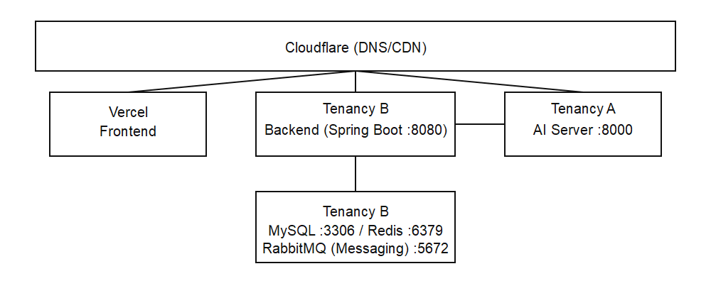
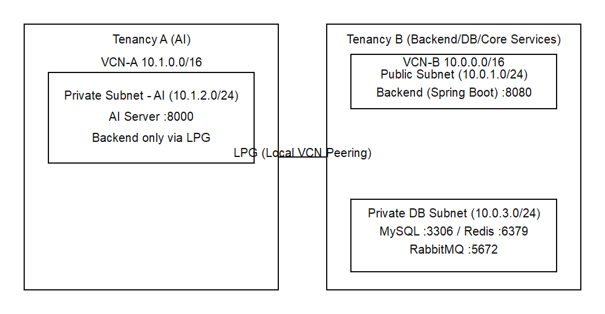

# WithBuddy 인프라 구조

> 클라우드 인프라 및 네트워크 구성

**최종 업데이트**: 2026-04-02  
**버전**: 1.3.1  
**작성일**: 2026-03-27

---

## 📋 목차

- [1. 인프라 개요](#1-인프라-개요)
- [2. 네트워크 구성](#2-네트워크-구성)
- [3. 보안 그룹](#3-보안-그룹)
- [4. 스토리지 구조](#4-스토리지-구조)
- [5. 서버 스펙](#5-서버-스펙)
- [6. 확장성 설계](#6-확장성-설계)
- [7. 백업 전략](#7-백업-전략)

---

## 1. 인프라 개요

### 1.1 클라우드 선택

WithBuddy는 **Oracle Cloud(OCI)** 로 결정했음.

**선정 이유**:
- 비용 효율 (Always Free/저비용 리소스 활용)
- 오사카 리전 제공
- Arm 기반 A1 인스턴스 가성비

### 1.2 인프라 구성 요소

[](./images/infrastructure-overview.png)

모바일에서는 이미지를 탭해 원본을 연 뒤 확대해서 확인하세요.

---

## 2. 네트워크 구성

### 2.1 VCN (Virtual Cloud Network) 설계

현재 구성은 **오사카 리전**에서 **두 개 테넌시 분리**로 운영한다.

[](./images/network-topology.png)

모바일에서는 이미지를 탭해 원본을 연 뒤 확대해서 확인하세요.

**중요**: 두 VCN의 CIDR은 반드시 겹치지 않아야 한다.

### 2.2 Cross-Tenancy LPG 피어링

**필수 정보**:
- VCN-A CIDR, VCN-B CIDR
- 양쪽 LPG OCID
- 라우트 테이블 및 보안 목록/NSG

**라우트 테이블 예시**:
```
VCN-A:
Destination         Target
10.0.0.0/16         LPG-A (to VCN-B)

VCN-B:
Destination         Target
10.1.0.0/16         LPG-B (to VCN-A)
```

### 2.3 Subnet 구성

#### VCN-A (AI 테넌시)

**Private Subnet - AI (10.1.2.0/24)**  
용도: AI 서버 전용 (Private)

| 리소스 | 포트 | 접근 |
|-------|------|------|
| AI Server (FastAPI) | 8000 | Backend only (LPG) |

**라우팅 테이블**:
```
Destination         Target
10.0.0.0/16         LPG-A (to VCN-B)
0.0.0.0/0           NAT Gateway (아웃바운드, 선택)
```

#### VCN-B (Backend/DB/Core Services 테넌시)

**Public Subnet (10.0.1.0/24)**  
용도: 외부에서 접근 가능한 Backend

| 리소스 | 포트 | 접근 |
|-------|------|------|
| Backend (Spring Boot) | 8080 | Vercel, 운영자 |

**라우팅 테이블**:
```
Destination         Target
0.0.0.0/0          Internet Gateway
10.0.0.0/16        Local
10.1.0.0/16        LPG-B (to VCN-A)
```

**Private Subnet - DB (10.0.3.0/24)**  
용도: 데이터베이스

| 리소스 | 포트 | 접근 |
|-------|------|------|
| MySQL 8.0 | 3306 | Backend, AI Server |
| Redis | 6379 | Backend, AI Server |
| RabbitMQ | 5672 | Backend, AI Server |

**라우팅 테이블**:
```
Destination         Target
10.0.0.0/16        Local
10.1.0.0/16        LPG-B (to VCN-A)
```

### 2.4 통신 경로 요약

- Frontend → Backend: Public HTTPS → Backend (8080)
- Backend ↔ AI: LPG (VCN-B ↔ VCN-A), 8000
- Backend → MySQL: VCN-B 내부, 3306
- AI → MySQL: LPG (VCN-A → VCN-B), 3306
- Backend/AI → Redis: VCN-B Private-DB 또는 LPG, 6379
- Backend/AI → RabbitMQ: VCN-B Private-DB 또는 LPG, 5672

---

## 3. 보안 그룹 (NSG/보안 목록)

### 3.1 Backend Public Access

```yaml
Name: sl-withbuddy-backend-public
Description: Backend 공개 접근 규칙 (Public Subnet)

Inbound Rules:
  - Type: HTTPS
    Protocol: TCP
    Port: 443
    Source: 0.0.0.0/0
    Description: Allow HTTPS from internet
    
  - Type: HTTP
    Protocol: TCP
    Port: 80
    Source: 0.0.0.0/0
    Description: Redirect to HTTPS

Outbound Rules:
  - Type: All
    Protocol: All
    Destination: 0.0.0.0/0
    Description: 일반 아웃바운드
```

### 3.2 Backend Security Group (VCN-B)

```yaml
Name: nsg-withbuddy-backend
Description: Backend (Spring Boot) security group

Inbound Rules:
  - Type: Custom TCP
    Protocol: TCP
    Port: 8080
    Source: 0.0.0.0/0
    Description: Public API (필요 시 Vercel IP로 제한)

Outbound Rules:
  - Type: MySQL
    Protocol: TCP
    Port: 3306
    Destination: 10.0.3.0/24
    Description: To MySQL (VCN-B)

  - Type: Custom TCP
    Protocol: TCP
    Port: 8000
    Destination: <VCN-A CIDR>
    Description: To AI Server via LPG

  - Type: Custom TCP
    Protocol: TCP
    Port: 6379
    Destination: 10.0.2.0/24
    Description: To Redis (VCN-B)
    
  - Type: HTTPS
    Protocol: TCP
    Port: 443
    Destination: 0.0.0.0/0
    Description: Anthropic Claude API, Object Storage
```

### 3.3 AI Server Security Group (VCN-A)

```yaml
Name: nsg-withbuddy-ai
Description: AI Server (FastAPI) security group

Inbound Rules:
  - Type: Custom TCP
    Protocol: TCP
    Port: 8000
    Source: <VCN-B CIDR>
    Description: From Backend via LPG only

Outbound Rules:
  - Type: MySQL
    Protocol: TCP
    Port: 3306
    Destination: <VCN-B CIDR>
    Description: To MySQL via LPG
    
  - Type: Custom TCP
    Protocol: TCP
    Port: 6379
    Destination: <VCN-B CIDR>
    Description: To Redis via LPG
    
  - Type: HTTPS
    Protocol: TCP
    Port: 443
    Destination: 0.0.0.0/0
    Description: Anthropic Claude API
```

### 3.4 MySQL Security Group (VCN-B)

```yaml
Name: nsg-withbuddy-mysql
Description: MySQL Database security group

Inbound Rules:
  - Type: MySQL
    Protocol: TCP
    Port: 3306
    Source: <VCN-B CIDR>
    Description: From Backend subnet
    
  - Type: MySQL
    Protocol: TCP
    Port: 3306
    Source: <VCN-A CIDR>
    Description: From AI via LPG

Outbound Rules:
  - None (데이터베이스는 아웃바운드 불필요)
```

### 3.5 Redis Security Group (VCN-B)

```yaml
Name: nsg-withbuddy-redis
Description: Redis Cache security group

Inbound Rules:
  - Type: Custom TCP
    Protocol: TCP
    Port: 6379
    Source: <VCN-B CIDR>
    Description: From Backend subnet
    
  - Type: Custom TCP
    Protocol: TCP
    Port: 6379
    Source: <VCN-A CIDR>
    Description: From AI via LPG

Outbound Rules:
  - None
```

### 3.6 RabbitMQ Security Group (VCN-B)

```yaml
Name: nsg-withbuddy-rabbitmq
Description: RabbitMQ messaging system security group

Inbound Rules:
  - Type: Custom TCP
    Protocol: TCP
    Port: 5672
    Source: <VCN-B CIDR>
    Description: From Backend subnet

  - Type: Custom TCP
    Protocol: TCP
    Port: 5672
    Source: <VCN-A CIDR>
    Description: From AI via LPG

  - Type: Custom TCP
    Protocol: TCP
    Port: 15672
    Source: <Admin Fixed IP/CIDR>
    Description: RabbitMQ management UI (운영자 전용)

Outbound Rules:
  - None
```

---

## 4. 스토리지 구조

### 4.1 Object Storage (S3/GCS/OCI)

#### 버킷 구조

```
withbuddy-storage/
├── documents/              # 인사/행정 문서
│   ├── templates/         # 문서 템플릿
│   │   └── hr_policy_template.pdf
│   ├── user-uploads/      # 사용자 업로드
│   │   ├── company_1001/
│   │   │   ├── 2024/
│   │   │   │   └── 03/
│   │   │   │       └── document_123.pdf
│   │   │   └── 2024/
│   │   └── company_1002/
│   └── generated/         # AI 생성 리포트
│       └── company_1001/
│           └── reports/
│               └── week_1_report.pdf
├── avatars/               # 프로필 이미지
│   ├── company_1001/
│   │   └── user_uuid_123.jpg
│   └── company_1002/
└── backups/               # 백업 파일
    ├── db/
    │   ├── daily/
    │   ├── weekly/
    │   └── monthly/
    └── logs/
```

**MVP 메모**: ChromaDB 임베딩 파일은 AI 서버 로컬 디스크에 저장하며, 별도 Object Storage로 분리하지 않는다.

#### 접근 권한 정책

```json
{
  "Version": "2012-10-17",
  "Statement": [
    {
      "Effect": "Allow",
      "Principal": {
        "Service": "ec2.amazonaws.com"
      },
      "Action": [
        "s3:GetObject",
        "s3:PutObject",
        "s3:DeleteObject"
      ],
      "Resource": "arn:aws:s3:::withbuddy-storage/*"
    }
  ]
}
```

**접근 방식**:
- ✅ Backend: IAM Role 기반 접근
- ✅ Frontend: Presigned URL (임시 다운로드)
- ❌ Public Read: 없음 (모든 파일 Private)

#### Lifecycle 정책

```yaml
documents/:
  - Transition to Infrequent Access: 90 days
  - Transition to Glacier: 1 year
  - Expire: Never

backups/daily/:
  - Expire: 30 days

backups/weekly/:
  - Expire: 90 days

backups/monthly/:
  - Expire: 1 year
```

### 4.2 데이터베이스 스토리지

#### MySQL Storage

```yaml
Instance Type: db.t3.medium (프로덕션)
Storage Type: SSD (gp3)
Allocated Storage: 100 GB
Max Storage: 500 GB (Auto Scaling)
IOPS: 3000
Throughput: 125 MiB/s

Backup:
  Retention: 7 days
  Window: 03:00-04:00 UTC (한국시간 12:00-13:00)
  
Maintenance:
  Window: Sun 04:00-05:00 UTC (한국시간 일요일 13:00-14:00)
```

#### Redis Storage

```yaml
Instance Type: cache.t3.medium
Engine Version: 7.0
Replicas: 1 (고가용성)
Max Memory: 3.09 GB
Eviction Policy: allkeys-lru

Snapshot:
  Frequency: Daily
  Retention: 7 days
```

---

## 5. 서버 스펙

오사카 리전 기준 실제 운영 사양:

### 5.1 Backend Server (Tenancy B)
```yaml
Shape: VM.Standard.A1.Flex
CPU: 2 OCPU
RAM: 12 GB
Network Bandwidth: 2 Gbps
OS: Canonical Ubuntu 24.04
Subnet: Public (VCN-B)
```

### 5.2 AI Server (Tenancy A)
```yaml
Shape: VM.Standard.A1.Flex
CPU: 4 OCPU
RAM: 24 GB
Network Bandwidth: 4 Gbps
OS: Canonical Ubuntu 24.04
Subnet: Private (VCN-A)
```

### 5.3 Database Server (Tenancy B)
```yaml
Shape: VM.Standard.A1.Flex
CPU: 2 OCPU
RAM: 12 GB
Network Bandwidth: 2 Gbps
OS: Canonical Ubuntu 24.04
Subnet: Private - DB (VCN-B)
```

### 5.4 Redis Cache (Tenancy B)
```yaml
Service: Redis
Subnet: Private - DB (VCN-B)
Host: Database Server (MySQL과 동일 인스턴스)
Port: 6379
Operation Policy:
  - 인터넷 비공개
  - Backend/AI 내부망만 접근 허용
  - 인증(requirepass 또는 ACL) 필수
```

### 5.5 RabbitMQ Messaging System (Tenancy B)
```yaml
Service: RabbitMQ
Subnet: Private - DB (VCN-B)
Host: Database Server (MySQL/Redis와 동일 인스턴스)
Role: 메시징 시스템 (비동기 작업 큐/재시도/DLQ)
Protocol: AMQP 0-9-1
Port: 5672
Management UI: 15672 (운영자 고정 IP만 허용)
High Availability:
  - MVP: 단일 노드
  - 확장: quorum queue + 다중 노드
```

---

## 6. 확장성 설계

### 6.1 Auto Scaling

#### Backend Auto Scaling 정책

```yaml
Scaling Policy:
  Metric: CPU Utilization
  Target: 70%
  
  Scale Out:
    Threshold: 70% for 2 minutes
    Action: Add 1 instance
    Cooldown: 300 seconds
    
  Scale In:
    Threshold: 30% for 5 minutes
    Action: Remove 1 instance
    Cooldown: 300 seconds

Limits:
  Min Instances: 2
  Max Instances: 4
```

#### Load Balancer 설정

```yaml
Type: Application Load Balancer (ALB)

Health Check:
  Protocol: HTTP
  Path: /actuator/health
  Interval: 30 seconds
  Timeout: 5 seconds
  Healthy Threshold: 2
  Unhealthy Threshold: 3

Target Group:
  Protocol: HTTP
  Port: 8080
  Deregistration Delay: 30 seconds
  
Sticky Sessions:
  Enabled: No (Stateless)
```

### 6.2 데이터베이스 확장

#### Read Replica

```yaml
Master: db.t3.medium (Write)
Replica 1: db.t3.medium (Read)

Traffic Distribution:
  Write: Master
  Read: Load Balanced (Master + Replica)
  
Failover:
  Automatic: Yes
  Failover Time: ~60 seconds
```

#### Connection Pool

```yaml
# Backend - HikariCP
spring.datasource.hikari:
  maximum-pool-size: 20
  minimum-idle: 5
  connection-timeout: 30000
  idle-timeout: 600000
  max-lifetime: 1800000
```

---

## 7. 백업 전략

### 7.1 데이터베이스 백업

#### 자동 백업

```yaml
Frequency: Daily
Time: 03:00 UTC (한국시간 12:00)
Retention: 7 days

Backup Type:
  - Automated Snapshots
  - Transaction Logs (Point-in-Time Recovery)
```

#### 수동 스냅샷

```yaml
Frequency: Weekly (매주 일요일)
Retention: 30 days
Purpose: Major changes, deployments
```

#### 복구 절차

```bash
# 1. 최신 스냅샷 확인
aws rds describe-db-snapshots \
  --db-instance-identifier withbuddy-mysql

# 2. 새 인스턴스로 복원
aws rds restore-db-instance-from-db-snapshot \
  --db-instance-identifier withbuddy-mysql-restored \
  --db-snapshot-identifier snapshot-20260317

# 3. 복원 확인
aws rds describe-db-instances \
  --db-instance-identifier withbuddy-mysql-restored

# 4. 애플리케이션 연결 변경
# (connection string 업데이트)
```

### 7.2 Object Storage 백업

```yaml
Versioning: Enabled
Replication: Cross-Region (선택)

Lifecycle:
  - Current versions: Keep forever
  - Non-current versions: Delete after 30 days
  
Backup:
  - Critical documents: Daily sync to backup bucket
  - Backup bucket: Different region
```

### 7.3 애플리케이션 백업

```yaml
Code:
  - Repository: GitHub
  - Backup: Git commits, tags
  
Configuration:
  - Location: Git repository (encrypted)
  - Secrets: AWS Secrets Manager / HashiCorp Vault
  
Logs:
  - Storage: CloudWatch Logs / ELK
  - Retention: 90 days
```

---

## 8. 모니터링 & 알림

### 8.1 CloudWatch 메트릭

```yaml
Backend:
  - CPUUtilization
  - MemoryUtilization
  - NetworkIn/Out
  - DiskReadOps/WriteOps

Database:
  - CPUUtilization
  - DatabaseConnections
  - ReadLatency/WriteLatency
  - FreeStorageSpace

Load Balancer:
  - TargetResponseTime
  - HealthyHostCount
  - RequestCount
  - HTTPCode_Target_2XX_Count
```

### 8.2 알림 설정

```yaml
Critical Alerts (즉시 알림):
  - Database CPU > 90% for 5 minutes
  - Backend healthy hosts < 1
  - Disk space < 10%
  
Warning Alerts (30분 후 알림):
  - Database CPU > 70% for 10 minutes
  - Backend healthy hosts < 2
  - Disk space < 20%
  
Notification:
  - Slack: #alerts-critical
  - Email: ops@withbuddy.com
```

---

## 부록

### A. OCI 서비스 매핑

| 기능 | Oracle Cloud (OCI) |
|------|---------------------|
| 컴퓨팅 | Compute (VM.Standard.A1.Flex) |
| 데이터베이스 | MySQL on Compute (VM.Standard.A1.Flex) |
| 스토리지 | Object Storage |
| 로드밸런서 | Load Balancer |
| 캐시 | Redis (Compute 또는 Managed Cache) |
| 네트워크 | VCN + Local VCN Peering (LPG) |

### B. 비용 예측 (월간, OCI 기준)

MVP 기준 실제 인스턴스 스펙:

```
AI Server (A1.Flex 4 OCPU / 24GB):        TBD
Backend (A1.Flex 2 OCPU / 12GB):          TBD
Database (A1.Flex 2 OCPU / 12GB):         TBD
Redis (DB 서버 공용):                      TBD
Load Balancer:                            TBD
Object Storage:                           TBD
Data Transfer:                            TBD
                                  ──────────
Total:                                    TBD
```

현재는 OCI 과금 기준에 따라 변동 폭이 커서 추정치를 보류한다.

### C. 체크리스트

**인프라 구축 순서**:
- [ ] VCN 생성
- [ ] Subnet 구성 (Public, Private-App, Private-DB)
- [ ] Internet Gateway 생성
- [ ] NAT Gateway 생성
- [ ] 라우팅 테이블 설정
- [ ] 보안 그룹 생성
- [ ] Load Balancer 생성
- [ ] EC2 인스턴스 생성 (Backend, AI)
- [ ] RDS MySQL 생성
- [ ] ElastiCache Redis 생성
- [ ] S3 버킷 생성
- [ ] IAM 역할 설정
- [ ] CloudWatch 알람 설정

---

## 변경 이력

- 2026-03-27: OCI 확정 반영, 테넌시 분리 구조와 LPG 피어링 추가, 실제 서버 스펙 반영, 보안 규칙 및 부록 업데이트, 다이어그램 이미지 추가.
- 2026-04-01: Redis(캐시)와 RabbitMQ(메시징) 분리 운영을 반영해 통신 경로, RabbitMQ NSG, 브로커 스펙을 추가.
- 2026-04-02: 2.1 VCN 설계 다이어그램을 현재 운영 구조(Tenancy A AI / Tenancy B Backend+DB)로 재정렬하고 미사용 구성 표기를 제거.
