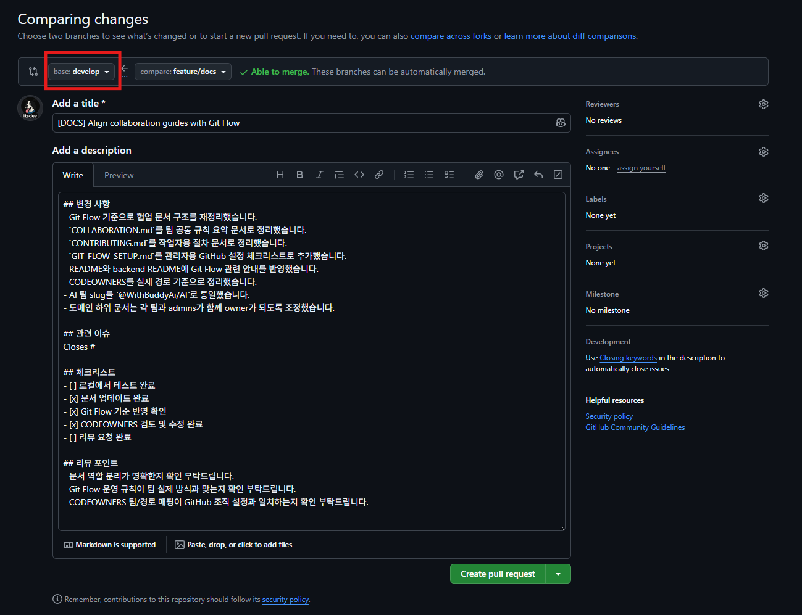

# 기여 가이드


> WithBuddy 프로젝트에 기여하는 방법
> 이 문서는 실제 작업자가 브랜치를 만들고, 커밋하고, PR을 올릴 때 따라야 하는 절차를 설명한다.


**최종 업데이트**: 2026-03-23  
**버전**: 1.0.0

## 📋 목차
- [기여 프로세스](#기여-프로세스)
- [브랜치 전략](#브랜치-전략)
- [커밋 메시지 컨벤션](#커밋-메시지-컨벤션)
- [Pull Request 가이드](#pull-request-가이드)
- [코드 리뷰](#코드-리뷰)
- [다음 단계](#다음-단계)

---

## 기여 프로세스

### 1. 작업 시작 전 확인

1. GitHub Issue 또는 작업 범위를 확인한다.
2. 관련 라벨과 담당자를 확인한다.
3. 작업 기준 브랜치가 `develop` 인지 확인한다.

### 2. 브랜치 생성

```bash
# 기능 개발은 최신 develop 브랜치에서 시작
git checkout develop
git pull origin develop

# 새 작업 브랜치 생성
git checkout -b feature/123-add-feature
```

브랜치 예시:
```text
feature/123-add-weekly-report
fix/456-login-error
docs/update-readme
refactor/improve-service-logic
test/add-unit-tests
chore/update-dependencies
release/1.0.0
hotfix/1.0.1-fix-login
```

### 3. 개발

- 코드를 수정한다.
- 필요한 테스트를 추가하거나 수정한다.
- 로컬에서 테스트와 빌드를 먼저 확인한다.

### 4. 커밋

```bash
git add .
git commit -m "feat: Add weekly report generation feature"
```

커밋 전에 확인:
```text
- 불필요한 파일이 stage 되지 않았는가?
- 커밋 메시지가 컨벤션에 맞는가?
- 변경 의도가 한 커밋 안에서 일관적인가?
```

### 5. Push 및 Pull Request 생성

```bash
git push origin feature/123-add-feature
```

PR 생성 기준:
- `feature/*`, `fix/*`, `docs/*`, `refactor/*`, `test/*`, `chore/*` 의 base 브랜치는 `develop`
- `release/*`, `hotfix/*` 의 base 브랜치는 `main`

### 6. 리뷰 반영 및 merge

- 최소 1명 이상의 승인을 받는다.
- CI/CD 통과 여부를 확인한다.
- 리뷰 요청 사항을 반영한 뒤 다시 push 한다.
- 기본 merge 방식은 `Squash and merge` 를 사용한다.
- merge 후 작업 브랜치를 삭제한다.
- `release/*`, `hotfix/*` 는 `main` 반영 후 반드시 `develop` 에도 동기화한다.

### PR 생성 화면 예시

아래 예시처럼 기능 또는 문서 작업 브랜치는 `base: develop`, `compare: feature/...` 형태로 Pull Request를 생성한다.



- `base`: 변경사항이 병합될 대상 브랜치
- `compare`: 현재 작업한 브랜치
- 기능, 문서, 리팩토링 작업은 보통 `develop` 으로 PR 생성
- `release/*`, `hotfix/*` 는 예외적으로 `main` 으로 PR 생성

### 6. 리뷰 반영 및 merge

- 최소 1명 이상의 승인을 받는다.
- CI/CD 통과 여부를 확인한다.
- 리뷰 요청 사항을 반영한 뒤 다시 push 한다.
- 기본 merge 방식은 `Squash and merge` 를 사용한다.
- merge 후 작업 브랜치를 삭제한다.
- `release/*`, `hotfix/*` 는 `main` 반영 후 반드시 `develop` 에도 동기화한다.

## 빠른 체크리스트

PR 생성 전에 아래 항목을 확인한다.

```text
브랜치명이 규칙에 맞는가?
PR 대상 브랜치가 맞는가?
로컬 테스트가 통과하는가?
불필요한 변경 파일이 없는가?
리뷰어와 라벨을 지정했는가?
관련 이슈를 연결했는가?
```

## 브랜치 명명 규칙

```text
feature/이슈번호-간단한-설명
fix/이슈번호-버그-설명
docs/문서-수정-내용
refactor/리팩토링-내용
test/테스트-추가-내용
chore/빌드-설정-변경
release/버전
hotfix/버전-간단한-설명
release/버전
hotfix/버전-간단한-설명
```

### 예시
```text
feature/123-add-weekly-report
fix/456-login-error
docs/update-readme
refactor/improve-service-logic
test/add-unit-tests
chore/update-dependencies
release/1.0.0
hotfix/1.0.1-fix-login
```

### 브랜치 수명
```
- feature/* : PR merge 후 삭제
- fix/* : PR merge 후 삭제
- main : 영구 유지
```

---


## 커밋 메시지 컨벤션

### 기본 형식
```
<type>(<scope>): <subject>

<body>

<footer>
```

### Type
```
feat     : 새로운 기능 추가
fix      : 버그 수정
docs     : 문서 수정
style    : 코드 포맷팅 (세미콜론 누락 등, 코드 변경 없음)
refactor : 코드 리팩토링
test     : 테스트 코드 추가/수정
chore    : 빌드, 라이브러리 업데이트 등
```

### Scope (선택사항)
```
record   : 기록 도메인
user     : 사용자 도메인
auth     : 인증
conversation : Q&A 도메인
progress : 진행률
checklist : 체크리스트
```

### Subject
```
- 50자 이내
- 영문으로 작성 시 첫 글자 대문자
- 마침표 없음
- 명령형 사용 (Add, Fix, Update)
```

### 예시
```bash
feat(record): Add AI summary feature for daily records

- Integrate with FastAPI summarization endpoint
- Add summary button to record detail page
- Display summarized content with markdown support

Resolves: #123

feat: Implement weekly report generation

fix(auth): Resolve login authentication error

docs: Update API documentation

refactor(record): Improve record service logic

test(user): Add unit tests for UserService
```

---

## Pull Request 가이드

### PR 제목 컨벤션

```text
[TYPE] Brief description
```

예시:
```text
[FEAT] Add weekly report generation
[FIX] Resolve login authentication error
[DOCS] Update API documentation
[REFACTOR] Improve record service logic
```

### PR 템플릿
```markdown
## 요약
- 무엇을, 왜 변경했는지 한두 줄로 간단히 작성해주세요.

## 문서 버전 (문서 변경 시)
- 업데이트된 문서 버전을 적어주세요.
- 예시: `1.2.0`

## 변경 사항
- 변경된 동작/기능을 항목별로 적어주세요.
- (예) 로그인 실패 시 오류 메시지 개선

## 스크린샷/영상 (UI 변경 시)
- 전/후 비교가 가능하도록 첨부해주세요.

## 관련 이슈
- `Closes #이슈번호` 형식으로 연결해주세요.
- 예시: `Closes #123`

## 체크리스트
- [ ] 변경 의도와 범위를 이해할 수 있게 작성했다
- [ ] 로컬 테스트를 수행했다 (또는 테스트 불가 사유를 기록했다)
- [ ] 문서/가이드 업데이트가 필요한 경우 반영했다

## 💬 리뷰어에게
<!-- 특별히 확인해주었으면 하는 부분 -->
```

### PR 생성 시 확인사항

```text
브랜치명이 규칙에 맞는가?
PR 대상 브랜치가 맞는가?
커밋 메시지가 규칙에 맞는가?
로컬에서 테스트가 통과하는가?
충돌이 없는가?
리뷰어가 지정되어 있는가?
라벨이 추가되어 있는가?
관련 Issue가 링크되어 있는가?
```

```text
브랜치명이 규칙에 맞는가?
PR 대상 브랜치가 맞는가?
커밋 메시지가 규칙에 맞는가?
로컬에서 테스트가 통과하는가?
충돌이 없는가?
리뷰어가 지정되어 있는가?
라벨이 추가되어 있는가?
관련 Issue가 링크되어 있는가?
```

## 코드 리뷰

### 리뷰어가 보는 항목

```text
코드 품질
버그 가능성
가독성
테스트 충분성
컨벤션 준수 여부
```

### 좋은 리뷰 코멘트 예시

```text
이 부분은 Optional을 사용하면 더 안전할 것 같습니다. 어떻게 생각하시나요?
```

### approve 기준

```text
로직이 올바른가?
테스트가 충분한가?
컨벤션을 지켰는가?
문서가 필요 시 업데이트 되었는가?
CI/CD가 통과했는가?
```

## 다음 단계

- [코딩 컨벤션](../conventions/CODING.md) - Java, JavaScript, Python 규칙
- [개발 환경 설정](SETUP.md) - 로컬 개발 환경 구축
- [Git Flow 설정 체크리스트](GIT-FLOW-SETUP.md) - GitHub 저장소 보호 규칙
